# Torchvision_core_project

> 🎯 **Универсальный фреймворк для сравнительного тестирования и бенчмаркинга методов сегментации изображений**

[](https://www.python.org/)
[](https://pytorch.org/)
[](LICENSE)

---

## 📋 Оглавление

- [О проекте](#-о-проекте)
- [Возможности](#-возможности)
- [Установка](#-установка)
- [Структура проекта](#-структура-проекта)
- [Быстрый старт](#-быстрый-старт)
- [Использование](#-использование)
- [Поддерживаемые модели](#-поддерживаемые-модели)
- [Метрики качества](#-метрики-качества)
- [Конфигурация](#-конфигурация)
- [Оптимизации производительности](#-оптимизации-производительности)
- [Примеры](#-примеры)
- [Вклад в проект](#-вклад-в-проект)
- [Лицензия](#-лицензия)

---

## 🔍 О проекте

**Torchvision_core_project** — это масштабируемый фреймворк для исследования, сравнения и бенчмаркинга алгоритмов семантической сегментации изображений. Проект объединяет классические методы компьютерного зрения и современные нейросетевые архитектуры в едином интерфейсе.

### Ключевые особенности:

✅ **Единый интерфейс** для 50+ методов сегментации;  
✅ **Поддержка библиотек**: OpenCV, Scikit-Learn, Scikit-Image, PyTorch, Transformers, SMP;  
✅ **Две реализации PyTorch**: `TorchSegmenter` (базовая) и `TorchSegmenter2` (оптимизированная);  
✅ **Управление точностью**: fp32/fp16/bf16/int8 с автоматическим выбором под устройство;  
✅ **torch.compile поддержка**: графовая оптимизация с настраиваемыми режимами;  
✅ **Бенчмаркинг**: cold/hot запуски, замеры времени, памяти, метрик качества;  
✅ **Экспорт моделей**: TorchScript, ONNX, TensorRT (JIT/Dynamo);  
✅ **Визуализация**: автоматическое построение графиков и отчётов;  
✅ **Валидация**: сравнение реализаций между библиотеками;  
✅ **Обучение**: fine-tuning моделей на ADE20K и других датасетах;  
✅ **Warm-up утилиты**: точные замеры производительности.  

---

## ✨ Возможности

### 🧩 Методы сегментации

| Категория | Методы | Статус TorchSegmenter2 |
|-----------|--------|----------------------|
| **Пороговые** | Global, Adaptive, Otsu, Niblack, Sauvola, Bernsen, Phansalkar, Kittler-Illingworth, Kapur, Triangle, Multi-Otsu, Percentile, Local Contrast | ✅ Полная оптимизация |
| **Градиентные** | Sobel, Canny, Prewitt, Scharr, Laplacian, Roberts, LoG, DoG, Marr-Hildreth, Gradient Magnitude/Direction, Phase Congruency | ✅ Векторизовано + NMS |
| **Региональные** | Region Growing, Split-and-Merge, Flood Fill, Watershed, Random Walker | ✅ BFS + Numba fallback |
| **Кластеризация** | K-Means, DBSCAN, MeanShift | ⚠️ K-Means оптимизирован, остальные через sklearn |
| **Активные контуры** | Active Contour, GVF, Morphological Snakes, Chan-Vese | ✅ FFT-решение + векторизация |
| **Суперпиксели** | SLIC, Felzenszwalb, QuickShift | ⚠️ Через numpy/scipy (ограниченная оптимизация) |
| **Интерактивные** | GrabCut | ✅ GMM на PyTorch |
| **Нейросетевые** | SegFormer, Mask2Former, OneFormer, DeepLabV3+, U-Net, FPN, PSPNet, FCN, SegNet, SAM, DPT, UPerNet, Mask R-CNN |

### 📊 Метрики оценки

```python
# Доступные метрики для бинарной и многоклассовой сегментации
- IoU (Intersection over Union) / Jaccard Index
- Dice Coefficient / F1-Score
- Precision, Recall, Accuracy, F1-Score
- Pixel Accuracy, MAE (Mean Absolute Error)
- Hausdorff Distance (95th percentile)
- Confusion Matrix, Per-class IoU
- Area metrics (difference, ratio, overlap)
```

### 🚀 Производительность

| Функция | Описание |
|---------|----------|
| 🔥 **Cold/Hot benchmarking** | Замеры до и после warm-up с детекцией трансферов CPU↔GPU |
| ⚡ **Precision management** | Автоматический выбор fp32/fp16/bf16 под устройство (Ampere+ → bf16) |
| 🔄 **torch.compile** | Графовая оптимизация с режимами `reduce-overhead` / `max-autotune` |
| 💾 **VRAM оптимизация** | Автоматическое освобождение памяти между моделями |
| 📈 **Детальные отчёты** | CSV, JSON, HTML, LaTeX + визуализации через matplotlib/seaborn |
| 🧪 **Cross-backend export** | Экспорт в ONNX/TensorRT с валидацией согласованности результатов |
| ⚡ **CPU vs CUDA** | Сравнение скорости

---

## 🌐 Веб-интерфейс

Проект включает современный веб-интерфейс на **React + TypeScript** с интуитивным управлением и визуализацией результатов в реальном времени.

### 🔹 Запуск интерфейса

```bash
# 1. Запусти бэкенд (если ещё не запущен)
uvicorn backend.main:app --host 0.0.0.0 --port 8000 --reload

# 2. В отдельном терминале запусти фронтенд
cd frontend
npm install
npm run dev
```
Открой в браузере: `http://localhost:5173`

### 🔹 Основные вкладки

| Вкладка | Описание |
|---------|----------|
| 🖼 **Результат** | Предпросмотр оригинала, маски, наложения и границ |
| 📊 **Метрики** | IoU, Dice, F1, Precision, Recall, MAE, Hausdorff + матрица ошибок |
| 💡 **Рекомендации** | Подбор оптимального метода под тип изображения и цель |
| 🔍 **Анализ** | Гистограмма интенсивностей, характеристики изображения, примеры по сценам |
| 📈 **Бенчмарк** | Кросс-модельное сравнение нейросетей с прогресс-баром и графиками |
| 🔬 **Валидация** | Сравнение реализаций одного метода в OpenCV / Sklearn / Torch |
| ⚖️ **Компаратор** | Детальное попарное и матричное сравнение классических методов |

### 🔹 Ключевые возможности UI

✅ **Интерактивный прогресс**: анимированные прогресс-бары для бенчмарков и валидации  
✅ **Поллинг в реальном времени**: автоматическое обновление статуса без перезагрузки  
✅ **Визуализация масок**: наложение, разность, границы — всё в одном интерфейсе  
✅ **Экспорт результатов**: скачивание отчётов в CSV, JSON, PNG, HTML  
✅ **Адаптивный дизайн**: корректное отображение на десктопе и планшетах  
✅ **Сохранение пресетов**: настройка бенчмарков и компараторов с возможностью сохранения  

### 🔹 Пример работы с бенчмарком

1. Загрузи изображение (или используй дефолтное из ADE20K)
2. Выбери модели для сравнения (или оставь по умолчанию)
3. Нажми **«▶ Запустить бенчмарк»**
4. Следи за прогрессом: загрузка моделей → инференс → сохранение
5. Изучай результаты: таблица метрик, графики IoU/времени, сводная визуализация

### 🔹 Валидация кросс-библиотечных реализаций

```typescript
// Пример конфигурации валидации
{
  "primary_library": "torch",
  "reference_library": "opencv", 
  "methods_filter": "threshold",  // threshold | edge | region | clustering
  "image": "test.jpg"
}
```

Интерфейс автоматически:
- Запускает выбранные методы в обеих библиотеках
- Сравнивает маски по метрикам (IoU, Dice, F1, area_ratio)
- Строит графики покрытия и матрицы различий
- Генерирует HTML-отчёт с визуализацией

### 🔹 Требования к браузеру

- Chrome 120+ / Firefox 115+ / Safari 17+
- Поддержка WebGL (для графиков Recharts)
- Разрешение экрана: ≥ 1280×720 (рекомендуется 1920×1080)

> 💡 **Совет**: Для работы с тяжёлыми бенчмарками используй режим «Только результаты» — он отключает предпросмотр масок и ускоряет загрузку.

### 📸 Галерея интерфейса

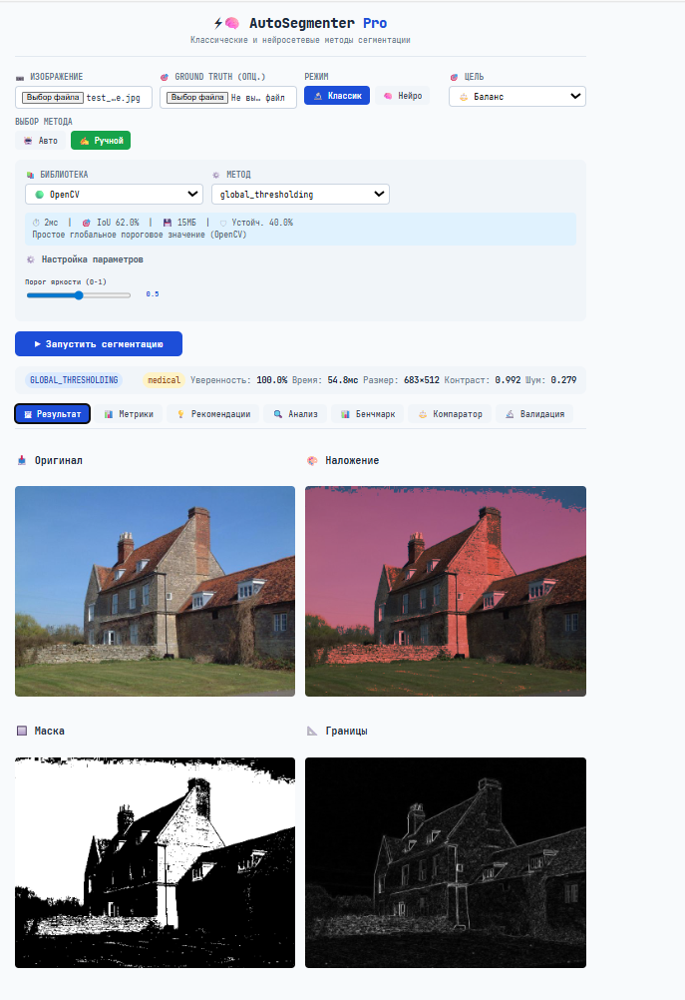
*Интуитивное управление: выбор режима, цели, метода*

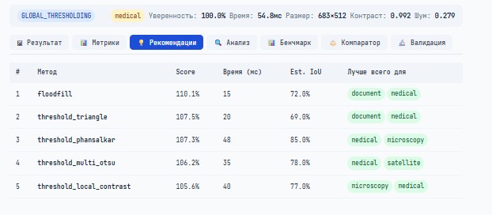
*Рекомендации метода для определённой задачи*

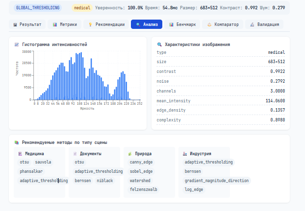
*Анализ изображения с характеристиками и гистограммой интенсивностей*

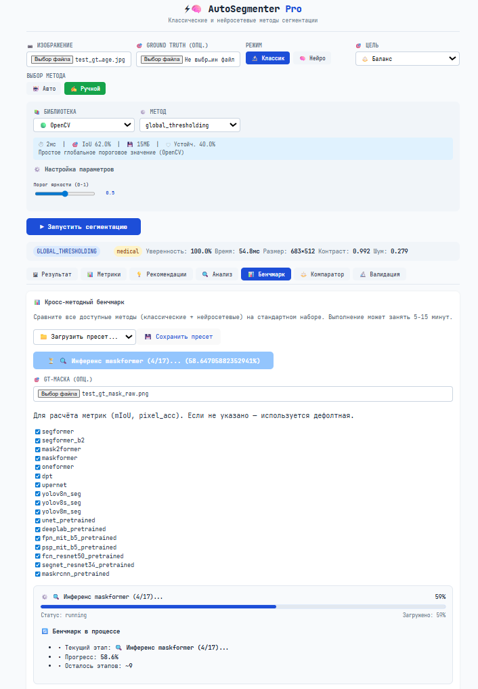
*Анимированный прогресс с детализацией по этапам*

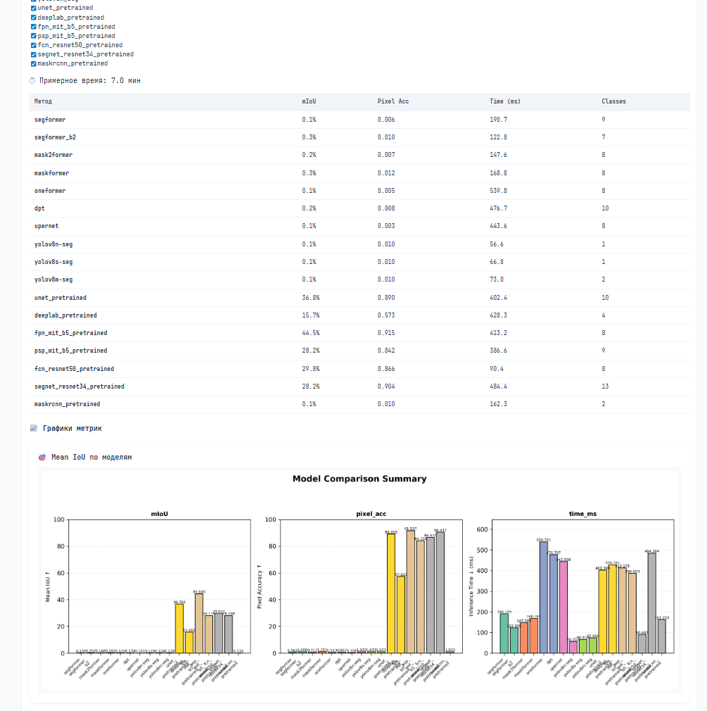
*Сравнительная таблица методов и графики метрик*

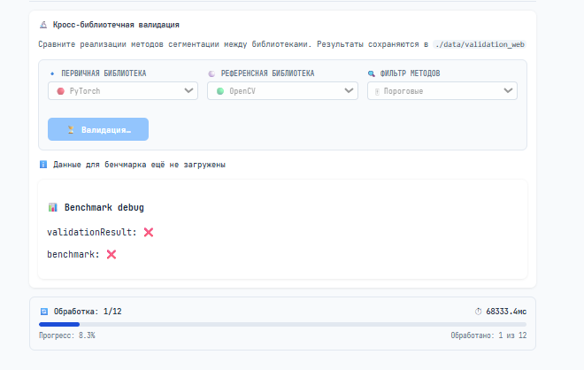
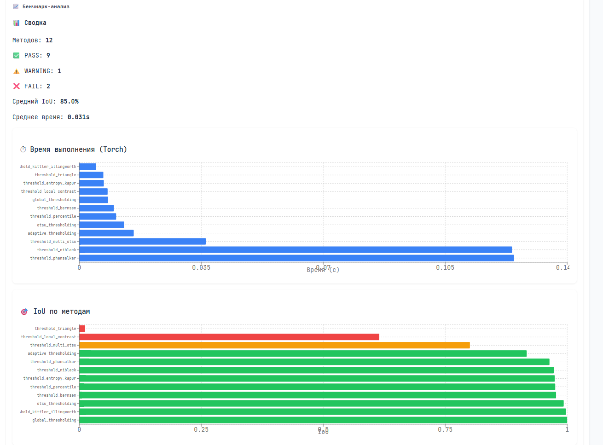
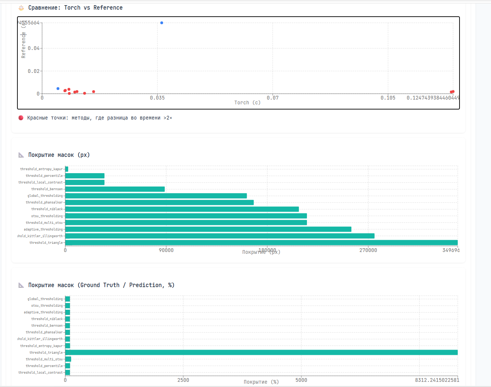
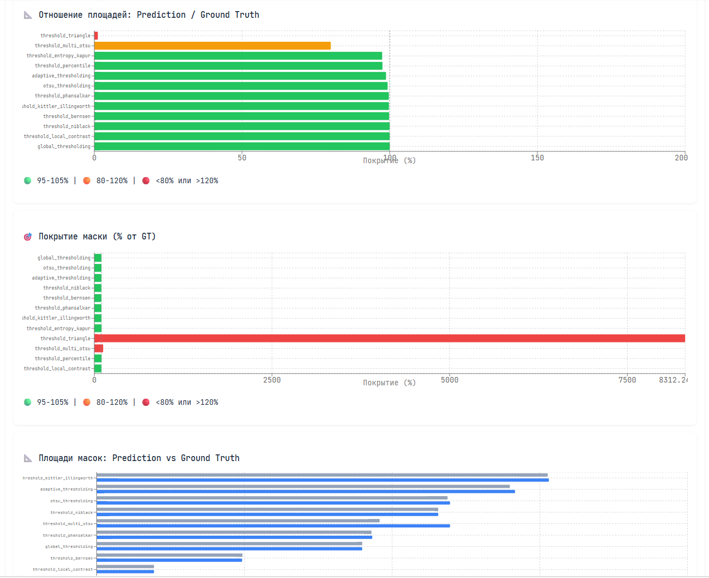
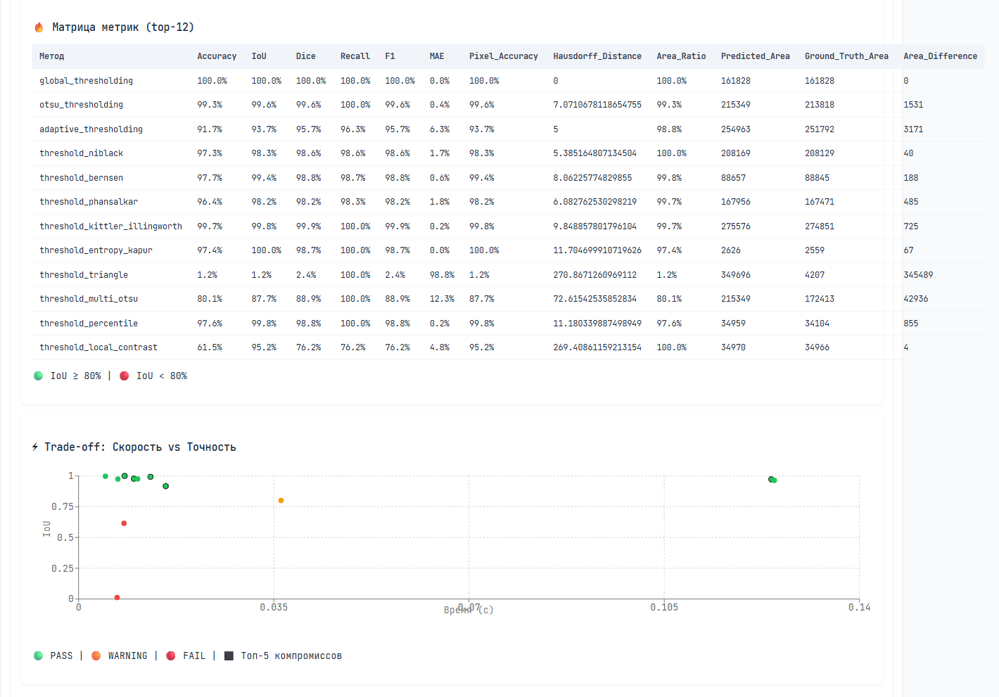
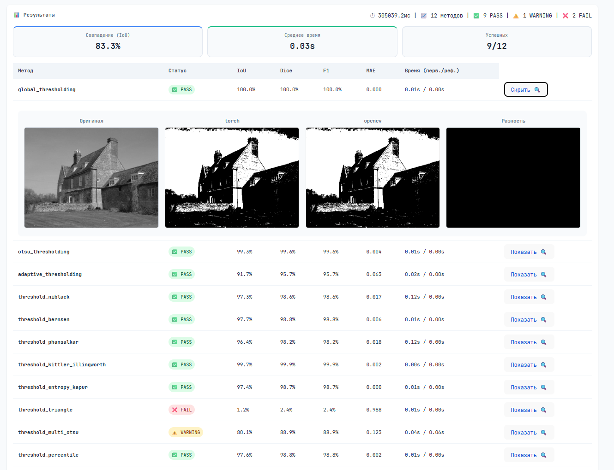
*Сравнение OpenCV vs Torch с метриками и визуализацией*

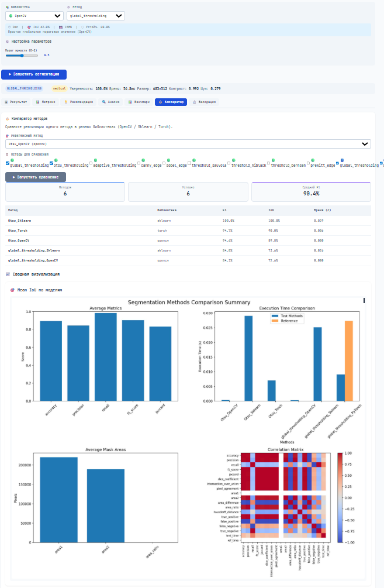
*Сравнение сводной визуализации на основе референсного метода*

---

## 📦 Установка

### Системные требования

- Python 3.12+
- CUDA 12.0+ (опционально, для GPU-ускорения)
- ~20-22 ГБ свободного места для моделей

### Параметры CUDA платформы

```bash
$ nvcc --version
nvcc: NVIDIA (R) Cuda compiler driver
Copyright (c) 2005-2023 NVIDIA Corporation
Built on Fri_Jan__6_16:45:21_PST_2023
Cuda compilation tools, release 12.0, V12.0.140
```

### Установка зависимостей

```bash
# Клонирование репозитория
git clone https://github.com/yourusername/torchvision_core_project.git
cd torchvision_core_project

# Создание виртуального окружения
python -m venv venv
source venv/bin/activate  # Linux/Mac
# или
venv\Scripts\activate  # Windows

# Установка базовых зависимостей
pip install -r requirements.txt

# Установка опциональных зависимостей для нейросетей
pip install -r requirements_neural.txt  # transformers, ultralytics, segmentation-models-pytorch

# Для экспорта в TensorRT (опционально)
pip install torch-tensorrt  # или использовать torch2trt
```

### requirements.txt (базовый)
```txt
datasets>=4.4.1
huggingface-hub>=0.36.0
matplotlib>=3.10.7
numpy>=2.2.0
opencv-python>=4.12.0
pandas>=2.3.3
pillow>=8.3.0
pyyaml>=6.0
requests>=2.32.0
scipy>=1.16.0
scikit-learn>=1.8.0
scikit-image>=0.25.0
seaborn>=0.13.0
tabulate>=0.10.0
torch>=2.6.0
torchmetrics>=1.8.2
torchvision>=0.21.0
transformers>=4.57.3
tqdm>=4.67.1
numba>=0.60.0  # Для CPU-оптимизаций
```

---

## 🗂️ Структура проекта

```
torchvision_core_project/
├── main.py                          # Точка входа и демонстрация всех возможностей
├── README.md                        # Документация
├── requirements.txt                 # Зависимости
├── LICENSE                          # Лицензия проекта
├── .gitignore                       # Игнор модулей
├── .gitattributes                   # Гит-атрибуты
├── __init__.py                      # Инициализация пакета
│
├── segmenters/                      # Реализации сегментаторов
│   ├── __init__.py                 # Инициализация
│   ├── BaseSegmenter.py            # Абстрактный базовый класс
│   ├── ModelTrainer.py             # Тренировка изначальных моделей
│   ├── OpenCVSegmenter.py          # Методы на OpenCV
│   ├── SklearnSegmenter.py         # Методы на Scikit-learn
│   ├── TorchSegmenter.py           # Методы на чистом PyTorch (v1)
│   ├── NewTorchSegmenter.py        # Оптимизированные методы (TorchSegmenter2, v2)
│   ├── NeuralSegmenter.py          # Универсальный нейросетевой сегментатор
│   ├── NeuralModelFactory.py       # Фабрика моделей + YAML-конфиги
│   ├── NeuralTrainer.py            # Трейнер для fine-tuning
│   └── BackendSegmenters.py        # ONNX/TensorRT обёртки
│
├── testing/                         # Инструменты тестирования
│   ├── SegmentationTester.py       # Тестирование отдельных методов
│   ├── SegmentationComparator.py   # Попарное и матричное сравнение
│   ├── SegmentationBenchmark.py    # Бенчмарк нейросетевых моделей
│   ├── TorchImplementationValidator.py  # Валидация PyTorch-реализаций
│   ├── BatchClassicTester.py       # Массовое тестирование классических методов
│   └── CpuCudaBenchmark.py         # Сравнение CPU vs CUDA
│
├── metrics/                         # Метрики качества
│   └── SegmentationMetrics.py      # Расчёт всех метрик
│
├── inference/                       # Стратегии инференса
│   ├── strategies.py               # Dispatch-функции для разных архитектур
│   ├── utils.py                    # Утилиты анализа логов и предсказаний
│   └── palettes.py                 # Цветовые палитры (ADE20K, COCO, Cityscapes)
│
├── datasets/                        # Загрузчики датасетов
│   ├── LoadDatasets.py             # Загрузка датасетов с HF
│   └── ADE20KDataset.py            # Датасет ADE20K с аугментациями
├── reports/                         # YAML-конфигурации
│   └── *_report.md                  # Предикты нейросетевых моделей
│
├── utils/                           # Вспомогательные утилиты
│   ├── warmup.py                   # Warm-up для бенчмарков
│   ├── threshold_warmup.py         # Специализированный warm-up
│   ├── backend_exporter.py         # Экспорт в ONNX/TensorRT
│   └── config.py                   # Управление конфигурацией
│
├── configs/                         # YAML-конфигурации
│   └── neural_models.yaml          # Параметры нейросетевых моделей
│
├── data/                            # Выходные данные (генерируется)
│   ├── segmentation_tester_results/
│   ├── validation/
│   ├── ade20k_test_trained/
│   ├── backend_comparison/
│   └── ...
│
└── models/                          # Сохранённые чекпоинты (опционально)
    ├── *.pt
    └── *.pth
```

---

## 🚀 Быстрый старт

### 1. Запуск основного теста

#### Базовый запуск
```bash
python main.py
```

#### Отладочный режим с подробными ошибками
```bash
DEBUG=1 python main.py
```

#### Проверка типов
```bash
mypy main.py --ignore-missing-imports
```

#### Проверка документации
```bash
pydocstyle main.py --convention=google
```

Проект автоматически:
- Загрузит тестовые изображения
- Инициализирует методы сегментации (включая оптимизированные TorchSegmenter2)
- Выполнит бенчмарк производительности (cold/hot)
- Проведёт валидацию реализаций
- Сохранит результаты в `./data/`

### 2. Минимальный пример использования

```python
from segmenters.OpenCVSegmenter import OpenCVSegmenter
from segmenters.SklearnSegmenter import SklearnSegmenter
from segmenters.NewTorchSegmenter import TorchSegmenter2
from testing.SegmentationTester import SegmentationTester
from PIL import Image
import numpy as np
import torch

# Загрузка изображения
image = Image.open("test.jpg").convert("RGB")
img_array = np.array(image)

# Инициализация тестера
tester = SegmentationTester(base_output_dir="./results")

# Добавление методов (включая оптимизированную версию)
tester.add_method("Otsu_CV2", OpenCVSegmenter("otsu_thresholding"))
tester.add_method("Otsu_Sklearn", SklearnSegmenter("otsu_thresholding"))
tester.add_method("Otsu_Torch_v2", TorchSegmenter2(
    method="otsu_thresholding",
    device="cuda" if torch.cuda.is_available() else "cpu",
    precision="bf16",  # Автоматический выбор точности
    use_compile=True   # Включить torch.compile
))

# Запуск сравнения
results = tester.compare_methods(
    image=img_array,
    method_names=["Otsu_CV2", "Otsu_Torch_v2", "Otsu_Sklearn"],
    save_comparison=True
)

# Вывод результатов
for name, data in results.items():
    print(f"{name}: {data['time']:.3f}s, IoU: {data.get('iou', 'N/A')}")
```

### 3. Бенчмарк с управлением точностью

```python
from segmenters.NewTorchSegmenter import TorchSegmenter2
import torch
import numpy as np

# Автоматический выбор точности под устройство
device = torch.device("cuda" if torch.cuda.is_available() else "cpu")
if device.type == "cuda":
    props = torch.cuda.get_device_properties(0)
    precision = "bf16" if props.major >= 8 else "fp16" if props.major >= 6 else "fp32"
else:
    precision = "fp32"

# Создание оптимизированного сегментера
segmenter = TorchSegmenter2(
    method="sobel_edge",
    device=str(device),
    precision=precision,
    use_compile=True,
    compile_mode="reduce-overhead"
)

# Запуск сегментации
mask = segmenter.segment(np.array(Image.open("test.jpg")))
print(f"Маска: {mask.shape}, dtype: {mask.dtype}")
```

### 4. Бенчмарк нейросетевой модели

```python
from segmenters.NeuralSegmenter import NeuralSegmenter
from testing.SegmentationBenchmark import SegmentationBenchmark

# Загрузка предобученной модели
segmenter = NeuralSegmenter(
    model_type="segformer",
    model_name="nvidia/segformer-b5-finetuned-ade-640-640",
    num_classes=150
)

# Бенчмарк
benchmark = SegmentationBenchmark(device="cuda", num_classes=150)
benchmark.load_model("segformer_b5", segmenter.model, segmenter.processor, "segformer")

# Запуск инференса
result = benchmark.run_single("test.jpg", "segformer_b5", alpha=0.6)
print(f"IoU: {result['metrics'].get('iou', 'N/A'):.4f}")
```

---

## 🧠 Поддерживаемые модели

### 🔹 Transformer-based (HuggingFace)

| Модель | Ключ | Описание |
|--------|------|----------|
| SegFormer | `segformer` | Efficient Transformer для семантической сегментации |
| Mask2Former | `mask2former` | Универсальная сегментация (semantic/instance/panoptic) |
| OneFormer | `oneformer` | Multi-task универсальный сегментатор |
| DPT | `dpt` | Dense Prediction Transformer |
| UPerNet | `upernet` | CNN + FPN для семантической сегментации |

### 🔹 Torchvision

| Модель | Ключ | Описание |
|--------|------|----------|
| DeepLabV3+ | `deeplab_tv` | Atrous Spatial Pyramid Pooling |
| FCN | `fcn_tv` | Fully Convolutional Networks |
| Mask R-CNN | `maskrcnn_tv` | Instance segmentation (конвертируется в semantic) |

### 🔹 Segmentation Models Pytorch (SMP)

| Архитектура | Encoder | Ключ |
|-------------|---------|------|
| U-Net | ResNet, EfficientNet, MiT | `unet_smp` |
| FPN | ResNet, EfficientNet, MiT | `fpn_smp` |
| PSPNet | ResNet, EfficientNet, MiT | `psp_smp` |
| DeepLabV3+ | ResNet, EfficientNet | `deeplab_smp` |

### 🔹 Промпт-сегментация

| Модель | Ключ | Описание |
|--------|------|----------|
| MobileSAM | `sam` | Легковесная версия Segment Anything |
| SAM 2 | `sam2` | Обновлённая версия SAM с видео-поддержкой |

---

## 📐 Метрики качества

Все метрики рассчитываются через модуль `metrics.SegmentationMetrics`:

```python
from metrics.SegmentationMetrics import SegmentationMetrics

metrics = SegmentationMetrics.calculate_all_metrics(
    pred_mask=prediction,
    gt_mask=ground_truth,
    threshold=0.5,
    include_hausdorff=True
)

print(f"IoU: {metrics['iou']:.4f}")
print(f"Dice: {metrics['dice']:.4f}")
print(f"Hausdorff: {metrics['hausdorff_distance']:.2f}")
```

### Поддерживаемые метрики:

| Метрика | Диапазон | Описание |
|---------|----------|----------|
| `iou` / `jaccard` | [0, 1] | Пересечение над объединением |
| `dice` / `f1_score` | [0, 1] | Гармоническое среднее precision/recall |
| `precision` | [0, 1] | Доля верных положительных предсказаний |
| `recall` | [0, 1] | Полнота обнаружения объектов |
| `pixel_accuracy` | [0, 1] | Доля правильно классифицированных пикселей |
| `mae` | [0, 1] | Средняя абсолютная ошибка |
| `hausdorff_distance` | [0, ∞) | Максимальное расстояние между границами |
| `per_class_iou` | List[float] | IoU для каждого класса отдельно |

---

## ⚙️ Конфигурация

### 📄 Конфигурация нейросетевых моделей (`configs/neural_models.yaml`)

```yaml
models:
  segformer:
    default: b5
    variants:
      b0: "nvidia/segformer-b0-finetuned-ade-512-512"
      b1: "nvidia/segformer-b1-finetuned-ade-512-512"
      b2: "nvidia/segformer-b2-finetuned-ade-512-512"
      b3: "nvidia/segformer-b3-finetuned-ade-640-640"
      b4: "nvidia/segformer-b4-finetuned-ade-640-640"
      b5: "nvidia/segformer-b5-finetuned-ade-640-640"
  
  mask2former:
    default: "facebook/mask2former-swin-base-ade-semantic"
  
  unet:
    encoders: ["resnet34", "resnet50", "efficientnet-b0", "mit_b5"]
    default_encoder: "resnet34"

training:
  ade20k:
    batch_size: 4
    epochs: 20
    lr: 1e-4
    image_size: [512, 512]
    augmentations:
      basic: ["flip", "rotate"]
      medium: ["flip", "rotate", "color_jitter"]
      aggressive: ["flip", "rotate", "color_jitter", "random_crop", "blur"]

metrics:
  threshold: 0.5
  include_hausdorff: true
  ignore_index: 255
```

### 🔧 Использование конфига

```python
from segmenters.NeuralModelFactory import NeuralModelFactory

# Загрузка модели из конфига
model, processor, model_type = NeuralModelFactory.create_model_from_config(
    model_type="segformer",
    variant="b2",  # Берётся из YAML
    device="cuda"
)

# Получение параметров обучения
train_config = NeuralModelFactory.get_training_config("ade20k")
print(f"Batch size: {train_config['batch_size']}")
```

---

## ⚡ Оптимизации производительности

### 🔹 Управление точностью (Precision Management)

```python
from segmenters.NewTorchSegmenter import TorchSegmenter2, PrecisionManager
import torch

device = torch.device("cuda")

# Автоматический выбор точности
precision = PrecisionManager.get_optimal_precision(device)  # 'bf16' для Ampere+

segmenter = TorchSegmenter2(
    method="otsu_thresholding",
    device=str(device),
    precision=precision,  # fp32/fp16/bf16
    use_compile=True
)
```

| Точность | Поддержка | Когда использовать |
|----------|-----------|-------------------|
| `fp32` | Все устройства | По умолчанию, максимальная точность |
| `fp16` | CUDA ≥ 6.0 (Pascal+) | Ускорение в 1.5-2×, умеренная потеря точности |
| `bf16` | CUDA ≥ 8.0 (Ampere+) | Ускорение в 2-3×, минимальная потеря точности |
| `int8` | CPU (динамическое квантование) | Максимальное ускорение на CPU |

### 🔹 torch.compile конфигурация

```python
# Оптимальные настройки для разных методов
compile_configs = {
    "global_thresholding": {"fullgraph": True, "dynamic": True, "mode": "reduce-overhead"},
    "canny_edge": {"fullgraph": False, "dynamic": True, "mode": "reduce-overhead"},  # Условная логика
    "watershed": {"fullgraph": False, "dynamic": True, "mode": "reduce-overhead"},   # heapq
    "quickshift": {"use_compile": False},  # numpy-heavy, компиляция не поможет
}

segmenter = TorchSegmenter2(
    method="sobel_edge",
    use_compile=True,
    compile_mode="reduce-overhead",  # или "max-autotune" для тщательной оптимизации
    compile_fullgraph=True,  # False если метод содержит условную логику
    compile_dynamic=True  # Поддержка разных размеров изображений
)
```

### 🔹 Экспорт в ONNX / TensorRT

```python
from utils.backend_exporter import export_method_to_onnx_safe, export_method_to_trt_jit

# Экспорт в ONNX
export_method_to_onnx_safe(
    segmenter, 
    method_name="otsu_thresholding",
    output_path="./exports/otsu.onnx",
    opset_version=17,
    precision="fp16"
)

# Экспорт в TensorRT (через TorchScript)
export_method_to_trt_jit(
    segmenter,
    method_name="otsu_thresholding", 
    output_path="./exports/otsu.trt",
    precision="fp16",
    input_shape=(1, 3, 512, 512),
    min_shape=(1, 3, 256, 256),
    max_shape=(1, 3, 1024, 1024)
)
```

### 🔹 Бенчмарк точностей

```python
from main import generate_precision_report

# Сравнение времени и качества для разных точностей
df = generate_precision_report(
    methods=["otsu_thresholding", "sobel_edge"],
    image=np.array(Image.open("test.jpg")),
    output_path="./reports/precision_benchmark.csv",
    n_warmup=3,
    n_runs=10,
    compute_metrics=True  # Сравнивает IoU относительно fp32
)

print(df.pivot_table(index="method", columns="precision", values="mean_time_ms"))
```

---

## 🧪 Тестирование

```bash
# Все тесты
pytest tests/ -v

# Только быстрые тесты (без slow и integration)
pytest tests/ -v -m "not slow and not integration"

# Только тесты TorchSegmenter
pytest tests/test_torch_segmenter.py -v

# С покрытием кода
pytest tests/ --cov=segmenters --cov=metrics --cov-report=html

# С выводом самых медленных тестов
pytest tests/ --durations=10

# Только GPU тесты (если есть CUDA)
pytest tests/ -v -m gpu

# Параллельный запуск (требует pytest-xdist)
pytest tests/ -n auto
```

---

## 💡 Примеры

### 📊 Сравнение методов с Ground Truth

```python
from testing.SegmentationTester import SegmentationTester
from metrics.SegmentationMetrics import SegmentationMetrics
import numpy as np

# Загрузка GT
gt_mask = np.load("ground_truth.npy")

# Тестирование с метриками
result = tester.test_single_method_with_metrics(
    image="test.jpg",
    method_name="Otsu_CV2",
    ground_truth=gt_mask,
    output_dir="./results"
)

print(f"IoU: {result['metrics']['iou']:.4f}")
print(f"Time: {result['time']:.3f}s")
```

### 🔄 Валидация PyTorch-реализации против OpenCV

```python
from testing.TorchImplementationValidator import TorchImplementationValidator

validator = TorchImplementationValidator(output_dir="./validation")

# Валидация пороговых методов
results = validator.validate_segmentation_methods(
    image_path="test.jpg",
    methods_list=validator.threshold_methods,
    torch_segmenter_class=TorchSegmenter2,  # Используем оптимизированную версию
    reference_segmenter_class=OpenCVSegmenter,
    reference="opencv",
    validation_type="threshold"
)

# Генерация отчёта
validator.generate_validation_report({"threshold": results})
```

### 📈 Визуализация результатов бенчмарка

```python
from testing.SegmentationBenchmark import SegmentationBenchmark

benchmark = SegmentationBenchmark(device="cuda")
benchmark.load_segformer("/path/to/model")
benchmark.load_mask2former()

# Запуск сравнения
benchmark.compare(image_input="test.jpg")

# Построение графиков
benchmark.plot_comparison_chart("mIoU", title="IoU Comparison")
benchmark.plot_per_class_iou(top_k=20)
benchmark.plot_confusion_matrix("segformer", normalize='true')

# Экспорт в LaTeX для публикации
latex_table = benchmark.export_latex_table("Results on ADE20K")
print(latex_table)
```

### 🔥 Cold vs Hot бенчмарк

```python
from utils.warmup import SegmentationWarmUp
from testing.SegmentationTester import SegmentationTester

# Инициализация
tester = SegmentationTester(enable_warmup=True)
warmup = SegmentationWarmUp(n_warmup_runs=5)

# Cold run (без warm-up)
cold_results = tester.benchmark_methods(img, n_runs=10, force_warmup=False)

# Warm-up фаза
warmup.warmup_all_segmenters(tester.methods, image=img)

# Hot run (после warm-up)
hot_results = tester.benchmark_methods(img, n_runs=10, force_warmup=False)

# Сравнение
speedup = cold_results['Mean_Time_s'] / hot_results['Mean_Time_s']
print(f"Speedup после warm-up: {speedup.mean():.2f}x")
```

### 🚀 Профилирование с детекцией трансферов

```python
from segmenters.NewTorchSegmenter import TorchSegmenter2

segmenter = TorchSegmenter2(method="canny_edge", device="cuda", precision="bf16")

# Профилирование с детекцией CPU↔GPU трансферов
profile = segmenter.profile_with_transfer_detection(
    image=np.array(Image.open("test.jpg")),
    n_runs=10,
    detect_transfers=True
)

print(f"Среднее время: {profile['avg_time_ms']:.2f} мс")
print(f"Память: {profile['memory_mb']:.1f} МБ")

# Предупреждения о нежелательных трансферах
if profile.get("transfer_warnings"):
    print("⚠️  Найдены проблемные трансферы:")
    for w in profile["transfer_warnings"]:
        print(f"   • {w}")
```

---

## 🤝 Вклад в проект

Мы приветствуем вклад в развитие проекта! 

### Как внести изменения:

1. **Fork** репозиторий
2. Создайте ветку для фичи: `git checkout -b feature/amazing-feature`
3. Внесите изменения и добавьте тесты
4. Закоммитьте: `git commit -m 'Add: amazing feature'`
5. Запушьте: `git push origin feature/amazing-feature`
6. Откройте **Pull Request**

### Стандарты кода:

- Используйте **type hints** для всех функций
- Документируйте публичные методы в **Google-style docstrings**
- Следуйте **PEP 8** для форматирования
- Добавляйте юнит-тесты для новых функций
- Для оптимизаций: указывайте `@torch.no_grad()` и используйте `autocast` где возможно

### Запрос новых функций:

Откройте **Issue** с меткой `enhancement`, описав:
- Какую проблему решает фича
- Предлагаемый API/интерфейс
- Примеры использования
- Ожидаемое влияние на производительность

---

## 📄 Лицензия

Проект распространяется под лицензией **MIT**. См. файл [LICENSE](LICENSE) для деталей.

```
MIT License

Copyright (c) 2026 Torchvision_core_project contributors

Permission is hereby granted, free of charge, to any person obtaining a copy
of this software and associated documentation files (the "Software"), to deal
in the Software without restriction, including without limitation the rights
to use, copy, modify, merge, publish, distribute, sublicense, and/or sell
copies of the Software, and to permit persons to whom the Software is
furnished to do so, subject to the following conditions:

The above copyright notice and this permission notice shall be included in all
copies or substantial portions of the Software.

THE SOFTWARE IS PROVIDED "AS IS", WITHOUT WARRANTY OF ANY KIND, EXPRESS OR
IMPLIED, INCLUDING BUT NOT LIMITED TO THE WARRANTIES OF MERCHANTABILITY,
FITNESS FOR A PARTICULAR PURPOSE AND NONINFRINGEMENT. IN NO EVENT SHALL THE
AUTHORS OR COPYRIGHT HOLDERS BE LIABLE FOR ANY CLAIM, DAMAGES OR OTHER
LIABILITY, WHETHER IN AN ACTION OF CONTRACT, TORT OR OTHERWISE, ARISING FROM,
OUT OF OR IN CONNECTION WITH THE SOFTWARE OR THE USE OR OTHER DEALINGS IN THE
SOFTWARE.
```

---

## 🙏 Благодарности

- [HuggingFace Transformers](https://huggingface.co/transformers/) — предобученные модели
- [Segmentation Models PyTorch](https://github.com/qubvel/segmentation_models.pytorch) — архитектуры сегментации
- [Ultralytics](https://github.com/ultralytics) — реализации SAM
- [ADE20K Dataset](http://sceneparsing.csail.mit.edu/) — датасет для обучения
- [OpenCV](https://opencv.org/), [Scikit-learn](https://scikit-learn.org/) — классические алгоритмы
- [Numba](https://numba.pydata.org/) — JIT-компиляция для CPU-оптимизаций

---

> 💡 **Совет**: Для воспроизводимости результатов фиксируйте версии зависимостей и используйте `torch.use_deterministic_algorithms(True)` при необходимости. Для максимальной производительности на GPU используйте `bf16` на Ampere+ и `fp16` на более старых архитектурах.

*Последнее обновление: Май 2026*