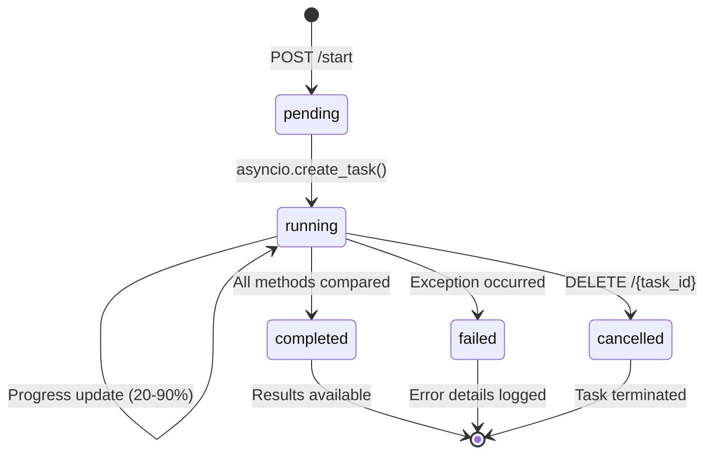

# 📚 Документация: `routers/comparator.py`

> **Модуль асинхронного сравнения методов сегментации изображений**

---

## 📋 Оглавление

1. [Обзор модуля](#-обзор-модуля)
2. [Архитектура](#-архитектура)
3. [API Endpoints](#-api-endpoints)
4. [Структура данных](#-структура-данных)
5. [Примеры использования](#-примеры-использования)
6. [Конфигурация методов](#-конфигурация-методов)
7. [Обработка ошибок](#-обработка-ошибок)
8. [Развёртывание](#-развёртывание)

---

## 🔍 Обзор модуля

### Назначение

Модуль `comparator.py` предоставляет **REST API интерфейс** для асинхронного сравнения различных методов сегментации изображений. Позволяет:

- 🔄 Запускать фоновые задачи сравнения методов
- 📊 Получать метрики качества (IoU, Dice, F1-Score, Precision, Recall)
- 🖼️ Генерировать визуализации результатов
- 📈 Отслеживать прогресс выполнения в реальном времени
- ❌ Отменять длительные задачи

### Поддерживаемые библиотеки

| Библиотека | Класс-сегментер | Примеры методов |
|-----------|----------------|----------------|
| **OpenCV** | `OpenCVSegmenter` | `otsu_thresholding`, `canny_edge`, `adaptive_thresholding` |
| **scikit-learn** | `SklearnSegmenter` | `otsu_thresholding`, `kmeans_segmentation`, `random_walker` |
| **PyTorch** | `TorchSegmenter` | `chan_vese`, `morphological_snakes`, `phase_congruency_edge` |

### Ключевые возможности

```
✅ Асинхронная обработка через asyncio
✅ Прогресс-трекинг задач (0-100%)
✅ Автоматическая генерация визуализаций
✅ Поддержка numpy-сериализации в JSON
✅ Thread-safe хранение состояния задач
✅ Детальное логирование и обработка ошибок
✅ Base64-кодирование изображений для API
```

---

## 🏗️ Архитектура

### Диаграмма компонентов

```
┌─────────────────────────────────────────┐
│           FastAPI Router                 │
│  /api/comparator/{start|status|cancel}  │
└────────────────┬────────────────────────┘
                 │
                 ▼
┌─────────────────────────────────────────┐
│         Task Management                  │
│  • _comparator_tasks: Dict[str, Task]   │
│  • _comparator_lock: asyncio.Lock       │
└────────────────┬────────────────────────┘
                 │
                 ▼
┌─────────────────────────────────────────┐
│      Background Worker                  │
│  _run_comparator_task()                 │
│  • Инициализация сегментеров            │
│  • Пошаговое сравнение методов          │
│  • Вычисление метрик                    │
│  • Генерация визуализаций               │
│  • Сохранение результатов               │
└────────────────┬────────────────────────┘
                 │
                 ▼
┌─────────────────────────────────────────┐
│      SegmentationComparator             │
│  (из testing.SegmentationComparator)    │
│  • compute_metrics()                    │
│  • visualize_comparison()               │
│  • batch_comparison()                   │
└─────────────────────────────────────────┘
```

### Жизненный цикл задачи



---

## 🌐 API Endpoints

### `POST /api/comparator/start`

Запускает новую задачу сравнения методов сегментации.

#### Параметры запроса

| Параметр | Тип | Расположение | Обязательный | Описание |
|---------|-----|-------------|-------------|----------|
| `image` | `UploadFile` | `multipart/form-data` | ✅ | Изображение для сегментации (JPG/PNG) |
| `methods` | `str` (JSON) | `form` | ✅ | Конфигурация сравниваемых методов |
| `reference` | `str` (JSON) | `form` | ✅ | Конфигурация референсного метода |
| `comparison_type` | `str` | `form` | ❌ | Тип сравнения: `"batch"` (по умолчанию) |

#### Формат `methods` JSON

```json
[
  {
    "name": "Otsu_OpenCV",
    "library": "opencv",
    "method": "otsu_thresholding",
    "params": {}
  },
  {
    "name": "Sauvola_Sklearn",
    "library": "sklearn", 
    "method": "threshold_sauvola",
    "params": {
      "window_size": 15,
      "k": 0.5,
      "r": 128
    }
  }
]
```

#### Формат `reference` JSON

```json
{
  "name": "Reference_Otsu",
  "library": "opencv",
  "method": "otsu_thresholding",
  "params": {}
}
```

#### Ответ (200 OK)

```json
{
  "task_id": "a1b2c3d4-e5f6-7890-abcd-ef1234567890"
}
```

#### Пример cURL

```bash
curl -X POST http://localhost:8000/api/comparator/start \
  -F "image=@test_image.jpg" \
  -F 'methods=[{"name":"Otsu_OpenCV","library":"opencv","method":"otsu_thresholding","params":{}}]' \
  -F 'reference={"name":"Ref","library":"opencv","method":"otsu_thresholding","params":{}}'
```

---

### `GET /api/comparator/status/{task_id}`

Получает статус и результаты задачи сравнения.

#### Параметры пути

| Параметр | Тип | Описание |
|---------|-----|----------|
| `task_id` | `str` (UUID) | Идентификатор задачи |

#### Ответы

**🟡 Задача в процессе (200)**

```json
{
  "status": "running",
  "progress": 45.5,
  "message": "Сравнение Sauvola_Sklearn (2/5)",
  "results": null
}
```

**🟢 Задача завершена (200)**

```json
{
  "status": "completed",
  "progress": 100,
  "message": "Готово",
  "results": {
    "summary": {
      "methods_count": 5,
      "successful": 4,
      "failed": 1,
      "top_by_f1": [
        {
          "method": "Sauvola_Sklearn",
          "f1_score": 0.94,
          "iou": 0.89,
          "test_time": 0.342
        }
      ],
      "avg_f1": 0.87
    },
    "results": [
      {
        "method": "Otsu_OpenCV",
        "library": "opencv",
        "iou": 0.82,
        "dice": 0.90,
        "f1_score": 0.88,
        "precision": 0.91,
        "recall": 0.85,
        "test_time": 0.125,
        "ref_time": 0.089
      }
    ],
    "output_dir": "./data/comparator_a1b2c3d4",
    "charts": {
      "comparison_summary.jpg": "iVBORw0KGgoAAAANSUhEUgAA...",
      "f1_score_matrix.png": "iVBORw0KGgoAAAANSUhEUgAA..."
    }
  }
}
```

**🔴 Задача не найдена (404)**

```json
{
  "detail": "Task not found"
}
```

---

### `DELETE /api/comparator/{task_id}`

Отменяет выполняющуюся задачу сравнения.

#### Параметры пути

| Параметр | Тип | Описание |
|---------|-----|----------|
| `task_id` | `str` (UUID) | Идентификатор задачи |

#### Ответы

**✅ Успешная отмена (200)**

```json
{
  "status": "cancelled",
  "message": "Отменено пользователем"
}
```

**⚠️ Задача уже завершена (200)**

```json
{
  "status": "completed",
  "message": "Already completed"
}
```

**❌ Задача не найдена (404)**

```json
{
  "status": "not_found",
  "message": "Task not found"
}
```

---

## 🗂️ Структура данных

### Task Object

```python
class ComparatorTask(TypedDict):
    status: Literal["pending", "running", "completed", "failed", "cancelled"]
    progress: float  # 0.0 - 100.0
    message: str     # Человекочитаемый статус
    results: Optional[TaskResults]
    error_details: Optional[ErrorDetails]  # Только при status="failed"

class TaskResults(TypedDict):
    summary: SummaryStats
    results: List[MethodResult]
    output_dir: str
    charts: Dict[str, str]  # filename -> base64

class SummaryStats(TypedDict):
    methods_count: int
    successful: int
    failed: int
    top_by_f1: List[MethodResult]  # Top-5 по F1-Score
    avg_f1: Optional[float]

class MethodResult(TypedDict):
    method: str
    library: str
    iou: Optional[float]
    dice: Optional[float]
    f1_score: Optional[float]
    precision: Optional[float]
    recall: Optional[float]
    test_time: float  # секунды
    ref_time: float   # секунды
    error: Optional[str]  # Только при ошибке
```

### NumpyEncoder

Кастомный энкодер для корректной сериализации numpy-типов в JSON:

```python
class NumpyEncoder(json.JSONEncoder):
    def default(self, obj: Any) -> Any:
        if isinstance(obj, np.integer):
            return int(obj)
        elif isinstance(obj, np.floating):
            if np.isnan(obj) or np.isinf(obj):
                return None  # JSON не поддерживает NaN/Inf
            return float(obj)
        elif isinstance(obj, np.ndarray):
            return obj.tolist()
        return super().default(obj)
```

---

## 💡 Примеры использования

### 🔹 Пример 1: Сравнение пороговых методов

```python
import requests
import json

# Конфигурация методов
methods = [
    {"name": "Global_CV2", "library": "opencv", "method": "global_thresholding", "params": {"threshold": 0.5}},
    {"name": "Otsu_CV2", "library": "opencv", "method": "otsu_thresholding", "params": {}},
    {"name": "Adaptive_CV2", "library": "opencv", "method": "adaptive_thresholding", "params": {"block_size": 11, "C": 2}},
    {"name": "Sauvola_SK", "library": "sklearn", "method": "threshold_sauvola", "params": {"window_size": 15, "k": 0.5}},
]

reference = {
    "name": "Reference_Otsu",
    "library": "opencv", 
    "method": "otsu_thresholding",
    "params": {}
}

# Запуск задачи
with open("document.jpg", "rb") as f:
    response = requests.post(
        "http://localhost:8000/api/comparator/start",
        files={"image": f},
        data={
            "methods": json.dumps(methods),
            "reference": json.dumps(reference),
            "comparison_type": "batch"
        }
    )
    task_id = response.json()["task_id"]

# Ожидание завершения
import time
while True:
    status = requests.get(f"http://localhost:8000/api/comparator/status/{task_id}")
    data = status.json()
    
    if data["status"] == "completed":
        print(f"✅ Завершено! Средняя F1: {data['results']['summary']['avg_f1']:.3f}")
        break
    elif data["status"] == "failed":
        print(f"❌ Ошибка: {data['message']}")
        break
    else:
        print(f"⏳ Прогресс: {data['progress']:.1f}% - {data['message']}")
        time.sleep(2)
```

### 🔹 Пример 2: Отмена задачи

```python
# Отмена задачи по task_id
response = requests.delete(f"http://localhost:8000/api/comparator/{task_id}")
print(response.json())
# {'status': 'cancelled', 'message': 'Отменено пользователем'}
```

### 🔹 Пример 3: Обработка результатов

```python
# После получения результата
results = data["results"]

# Топ-3 метода по F1-Score
print("\n🏆 Топ-3 метода:")
for i, method in enumerate(results["summary"]["top_by_f1"], 1):
    print(f"{i}. {method['method']}: F1={method['f1_score']:.3f}, IoU={method['iou']:.3f}")

# Сохранение визуализаций
for filename, b64_data in results["charts"].items():
    with open(f"./output/{filename}", "wb") as f:
        f.write(base64.b64decode(b64_data))
    print(f"📊 Сохранено: {filename}")
```

---

## ⚙️ Конфигурация методов

### Доступные методы по библиотекам

#### OpenCV (`library: "opencv"`)

```python
{
    "global_thresholding": {"threshold": 0.5},
    "otsu_thresholding": {},
    "adaptive_thresholding": {"block_size": 11, "C": 2},
    "threshold_sauvola": {"window_size": 15, "k": 0.5, "r": 128},
    "threshold_niblack": {"window_size": 15, "k": -0.2},
    "canny_edge": {"low": 0.1, "high": 0.3, "sigma": 1.0},
    "sobel_edge": {"threshold": 0.1},
    # ... ещё 40+ методов
}
```

#### scikit-learn (`library: "sklearn"`)

```python
{
    "otsu_thresholding": {},
    "adaptive_thresholding": {"block_size": 11, "C": 2},
    "threshold_sauvola": {"window_size": 15, "k": 0.5, "r": 128},
    "kmeans_segmentation": {"k": 3},
    "random_walker": {"beta": 130, "tol": 1e-3},
    # ... ещё 30+ методов
}
```

#### PyTorch (`library: "torch"`)

```python
{
    "otsu_thresholding": {},
    "adaptive_thresholding": {"block_size": 11, "C": 2},
    "chan_vese": {"mu": 0.25, "lambda1": 1.0, "max_iter": 100},
    "morphological_snakes": {"iterations": 100, "smoothing": 1},
    "phase_congruency_edge": {"nscales": 4, "norientations": 4},
    # ... ещё 35+ методов
}
```

### DEFAULT_COMPARATOR_METHODS

Предустановленная конфигурация для быстрого старта:

```python
DEFAULT_COMPARATOR_METHODS: Dict[str, List[str]] = {
    "opencv": [
        "global_thresholding", "otsu_thresholding", "adaptive_thresholding",
        "canny_edge", "sobel_edge", "threshold_sauvola",
    ],
    "sklearn": [  # Аналогичный список
    ],
    "torch": [  # Аналогичный список  
    ],
}
```

---

## ⚠️ Обработка ошибок

### Типы ошибок и коды ответов

| Код | Тип ошибки | Причина | Решение |
|-----|-----------|---------|---------|
| `400` | `HTTPException` | Некорректные параметры запроса | Проверить JSON-синтаксис в `methods`/`reference` |
| `404` | `HTTPException` | Task ID не найден | Убедиться, что задача существует и не истекла |
| `422` | `HTTPException` | Ошибка парсинга JSON | Валидировать JSON перед отправкой |
| `500` | `InternalError` | Внутренняя ошибка сегментера | Проверить логи, установить корректные параметры метода |

### Логирование ошибок

```python
# При ошибке в фоне задача получает статус "failed"
{
  "status": "failed",
  "message": "OpenCV error: (-215:Assertion failed) ...",
  "error_details": {
    "error_type": "cv2.error",
    "failed_at": "Сравнение Canny_OpenCV (1/3)",
    "traceback": "Traceback (most recent call last):\n  ..."  # Только при DEBUG
  }
}
```

### Рекомендации по отладке

1. **Включите DEBUG-логирование**:
   ```python
   logging.basicConfig(level=logging.DEBUG)
   ```

2. **Проверяйте `error_details`** в ответе при статусе `failed`

3. **Тестируйте методы по отдельности** перед пакетным запуском

4. **Используйте небольшие изображения** для отладки (≤512×512)

---

## 🚀 Развёртывание

### Требования

```txt
fastapi>=0.95.0
uvicorn>=0.22.0
numpy>=1.24.0
pandas>=2.0.0
pillow>=9.5.0
opencv-python>=4.7.0
scikit-learn>=1.2.0
torch>=2.0.0
python-multipart>=0.0.6  # Для обработки multipart/form-data
```

### Запуск сервера

```bash
# Установка зависимостей
pip install -r requirements.txt

# Запуск через uvicorn
uvicorn main:app --host 0.0.0.0 --port 8000 --reload

# Или с настройками для продакшена
uvicorn main:app \
  --host 0.0.0.0 \
  --port 8000 \
  --workers 4 \
  --log-level info
```

### Переменные окружения

| Переменная | Значение по умолчанию | Описание |
|-----------|---------------------|----------|
| `LOG_LEVEL` | `INFO` | Уровень логирования (`DEBUG`/`INFO`/`WARNING`/`ERROR`) |
| `DATA_DIR` | `./data` | Директория для сохранения результатов |
| `TASK_TTL` | `3600` | Время жизни задачи в секундах (авто-очистка) |

### Мониторинг задач

```python
# Проверка активных задач
import asyncio

async def list_active_tasks():
    async with _comparator_lock:
        active = {
            tid: t for tid, t in _comparator_tasks.items() 
            if t["status"] == "running"
        }
    return active

# Очистка завершённых задач (рекомендуется запускать периодически)
async def cleanup_tasks(max_age_seconds: int = 3600):
    async with _comparator_lock:
        now = time.time()
        to_remove = [
            tid for tid, t in _comparator_tasks.items()
            if t["status"] in ("completed", "failed", "cancelled")
            # и если задача старее max_age_seconds
        ]
        for tid in to_remove:
            del _comparator_tasks[tid]
        return len(to_remove)
```

---

## 📄 Лицензия

Данный модуль распространяется под лицензией **MIT**. См. файл `LICENSE` в корне репозитория.

---

> 💡 **Совет**: Для продакшена рекомендуется добавить:
> - 🔐 Аутентификацию эндпоинтов
> - 🗄️ Хранение задач в Redis/PostgreSQL вместо in-memory dict
> - 📦 Ограничение размера загружаемых изображений
> - 🔄 Механизм повторных попыток при временных ошибках
> - 📊 Метрики Prometheus для мониторинга производительности

---

*Документация актуальна для версии модуля `1.0.0`. Последнее обновление: 2024*