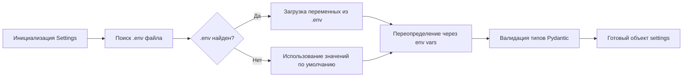

# 📁 Модуль конфигурации: `utils/settings.py`

> **Централизованное управление настройками приложения через Pydantic Settings**

Модуль предоставляет типизированную, валидируемую и расширяемую систему конфигурации для фреймворка сегментации изображений. Все параметры загружаются из переменных окружения (`.env` файл) или используют значения по умолчанию, что обеспечивает гибкость развёртывания в различных средах (локальная разработка, CI/CD, продакшен).

---

## 📋 Оглавление

- [Назначение](#-назначение)
- [Архитектура](#-архитектура)
- [Быстрый старт](#-быстрый-старт)
- [Переменные окружения](#-переменные-окружения)
- [API Reference](#-api-reference)
- [Примеры использования](#-примеры-использования)
- [Best Practices](#-best-practices)
- [Расширение конфигурации](#-расширение-конфигурации)
- [Устранение неполадок](#-устранение-неполадок)

---

## 🎯 Назначение

Модуль `Settings` решает следующие задачи:

| Задача | Решение |
|--------|---------|
| **Типизация конфигурации** | Pydantic валидация типов на этапе инициализации |
| **Источники настроек** | Приоритет: env vars → `.env` файл → значения по умолчанию |
| **Управление путями** | Автоматическая работа с `pathlib.Path`, кросс-платформенность |
| **Безопасность** | `extra="ignore"` — игнорирование неизвестных переменных |
| **Документирование** | Полные docstrings для IDE автодополнения |

---

## 🏗️ Архитектура

```
utils/settings.py
├── Settings (BaseSettings)
│   ├── model_config: SettingsConfigDict
│   ├── Пути к моделям и данным
│   ├── Имена чекпоинтов
│   └── Вспомогательные методы
│
├── Глобальный экземпляр: settings
│
└── Зависимости:
    ├── pydantic_settings.BaseSettings
    ├── utils.paths (PROJECT_ROOT, MODELS_DIR, ADE20K_DIR)
    └── pathlib.Path
```

### 🔄 Порядок загрузки конфигурации



---

## 🚀 Быстрый старт

### 1. Создание `.env` файла (опционально)

```bash
# Проектная директория/
├── .env                 # ← Создайте этот файл
├── utils/
│   └── settings.py
└── models/
```

```dotenv
# utils/settings.py — переменные окружения

# 📁 Пути к ресурсам
MODEL_DIR=./models/custom
DEFAULT_IMAGE=./data/test_sample.jpg
DEFAULT_GT=./data/test_sample_gt.png

# 🤖 Имена моделей и чекпоинтов
SEGFORMER_PATH=segformer-b5-finetuned-ade-640-640
UNET_CHECKPOINT=unet_ade20k_final_v2.pth
DEEPLAB_CHECKPOINT=deeplabv3+_ade20k_best.pth
FPN_MIT_CHECKPOINT=fpn_mit_b5_ade20k_300ep.pth
PSP_MIT_CHECKPOINT=psp_mit_b5_ade20k_300ep.pth
FCN_RESNET50_CHECKPOINT=fcn_resnet50_ade20k_trained.pth
SEGNET_RESNET34_CHECKPOINT=segnet_resnet34_ade20k.pth
```

### 2. Импорт и использование

```python
from utils.settings import settings

# Доступ к путям
print(f"Модели хранятся в: {settings.MODEL_DIR}")
# Вывод: Модели хранятся в: /path/to/project/models

# Получение полного пути к чекпоинту
unet_path = settings.get_model_full_path(settings.UNET_CHECKPOINT)
print(unet_path)
# Вывод: /path/to/project/models/unet_ade20k_best_200_epochs.pth

# Гарантия существования директории
settings.ensure_model_dir_exists()
```

### 3. Переопределение через env vars (без `.env`)

```bash
# В терминале перед запуском скрипта
export MODEL_DIR=/mnt/storage/models
export UNET_CHECKPOINT=my_custom_unet.pth

python main.py
```

---

## 🔧 Переменные окружения

| Переменная | Тип | Значение по умолчанию | Описание |
|------------|-----|----------------------|----------|
| `MODEL_DIR` | `Path` | `utils.paths.MODELS_DIR` | Базовая директория для моделей |
| `DEFAULT_IMAGE` | `Path` | `ADE20K_DIR/original_image_0.jpg` | Изображение для демо-тестов |
| `DEFAULT_GT` | `Path` | `ADE20K_DIR/original_image_mask_0.png` | GT-маска для демо-тестов |
| `SEGFORMER_PATH` | `str` | `"segformer-b5-ready"` | Имя/путь модели SegFormer |
| `UNET_CHECKPOINT` | `str` | `"unet_ade20k_best_200_epochs.pth"` | Чекпоинт U-Net |
| `DEEPLAB_CHECKPOINT` | `str` | `"deeplab_ade20k_best_200_epochs.pth"` | Чекпоинт DeepLabV3+ |
| `FPN_MIT_CHECKPOINT` | `str` | `"fpn_mit_b5_ade20k_best_200_epochs.pth"` | Чекпоинт FPN + MiT-B5 |
| `PSP_MIT_CHECKPOINT` | `str` | `"psp_mit_b5_ade20k_best_200_epochs.pth"` | Чекпоинт PSPNet + MiT-B5 |
| `FCN_RESNET50_CHECKPOINT` | `str` | `"fcn_resnet50_ade20k_best_200_epochs.pth"` | Чекпоинт FCN ResNet50 |
| `SEGNET_RESNET34_CHECKPOINT` | `str` | `"segnet_ade20k_best_200_epochs.pth"` | Чекпоинт SegNet ResNet34 |

> 💡 **Примечание**: Все пути автоматически преобразуются в `pathlib.Path` объекты.

---

## 📚 API Reference

### Класс `Settings`

```python
class Settings(BaseSettings):
    """
    Конфигурация приложения через Pydantic Settings.
    
    Загружает переменные окружения из `.env` файла и предоставляет
    типизированный доступ к путям и параметрам моделей.
    
    Attributes:
        model_config (SettingsConfigDict): Конфигурация Pydantic.
            - env_file: Имя файла с переменными окружения (".env").
            - extra: Поведение при неизвестных полях ("ignore").
        
        MODEL_DIR (Path): Базовая директория для сохранения/загрузки моделей.
            По умолчанию: значение из utils.paths.MODELS_DIR.
            Переопределяется: env var `MODEL_DIR`.
        
        DEFAULT_IMAGE (Path): Путь к изображению по умолчанию для тестов.
            Используется в демо-скриптах и бенчмарках.
        
        DEFAULT_GT (Path): Путь к ground truth маске по умолчанию.
            Используется для валидации и расчёта метрик.
        
        SEGFORMER_PATH (str): Имя/путь модели SegFormer.
            Относительно MODEL_DIR или абсолютный путь.
        
        UNET_CHECKPOINT (str): Имя файла чекпоинта U-Net.
        
        DEEPLAB_CHECKPOINT (str): Имя файла чекпоинта DeepLabV3+.
        
        FPN_MIT_CHECKPOINT (str): Имя файла чекпоинта FPN + MiT-B5.
        
        PSP_MIT_CHECKPOINT (str): Имя файла чекпоинта PSPNet + MiT-B5.
        
        FCN_RESNET50_CHECKPOINT (str): Имя файла чекпоинта FCN ResNet50.
        
        SEGNET_RESNET34_CHECKPOINT (str): Имя файла чекпоинта SegNet ResNet34.
    
    Raises:
        ValidationError: При несоответствии типов переменных окружения.
    
    Example:
        ```python
        from utils.settings import settings
        
        # Прямой доступ к атрибутам
        print(settings.MODEL_DIR)  # Path('/path/to/models')
        
        # Использование вспомогательных методов
        checkpoint = settings.get_model_full_path(settings.UNET_CHECKPOINT)
        settings.ensure_model_dir_exists()
        ```
    """
```

### Методы

#### `get_model_full_path(checkpoint_name: str) -> Path`

```python
def get_model_full_path(self, checkpoint_name: str) -> Path:
    """
    Возвращает полный путь к файлу модели.
    
    Конкатенирует MODEL_DIR с именем файла, обеспечивая
    кросс-платформенную совместимость через pathlib.
    
    Args:
        checkpoint_name: Имя файла чекпоинта (без директории).
            Пример: "unet_ade20k_best_200_epochs.pth"
    
    Returns:
        Path: Полный путь `MODEL_DIR / checkpoint_name`.
            Тип возвращаемого значения — pathlib.Path.
    
    Example:
        ```python
        from utils.settings import settings
        
        # Получение пути к чекпоинту
        path = settings.get_model_full_path("my_model.pth")
        print(path)
        # Вывод: /project/models/my_model.pth
        
        # Использование с torch.load
        import torch
        state_dict = torch.load(settings.get_model_full_path(
            settings.UNET_CHECKPOINT
        ))
        ```
    """
```

#### `ensure_model_dir_exists() -> None`

```python
def ensure_model_dir_exists(self) -> None:
    """
    Создаёт директорию моделей, если она не существует.
    
    Использует `mkdir(parents=True, exist_ok=True)` для:
    - Создания промежуточных директорий при необходимости
    - Безопасного повторного вызова (не вызывает ошибку, если директория есть)
    
    Side Effects:
        Создаёт файловую структуру на диске.
    
    Example:
        ```python
        from utils.settings import settings
        
        # Гарантия существования директории перед сохранением
        settings.ensure_model_dir_exists()
        
        # Теперь можно безопасно сохранять модели
        torch.save(model.state_dict(), 
                  settings.get_model_full_path("new_model.pth"))
        ```
    
    Note:
        Метод идемпотентен — многократный вызов не вызывает ошибок.
    """
```

---

## 💡 Примеры использования

### 🎯 Сценарий 1: Загрузка предобученной модели

```python
from utils.settings import settings
from segmenters.NeuralSegmenter import NeuralSegmenter
import torch

# Инициализация сегментера с путём из конфига
segmenter = NeuralSegmenter(
    model_type="segformer",
    local_path=str(settings.MODEL_DIR / settings.SEGFORMER_PATH),
    num_classes=150
)

# Загрузка чекпоинта (если требуется)
checkpoint_path = settings.get_model_full_path(settings.UNET_CHECKPOINT)
if checkpoint_path.exists():
    state_dict = torch.load(checkpoint_path, map_location="cpu")
    segmenter.model.load_state_dict(state_dict)
```

### 🎯 Сценарий 2: Тестирование с дефолтными данными

```python
from utils.settings import settings
from PIL import Image

# Загрузка тестового изображения и GT
test_img = Image.open(settings.DEFAULT_IMAGE).convert("RGB")
gt_mask = Image.open(settings.DEFAULT_GT).convert("L")

print(f"Тестируем на: {settings.DEFAULT_IMAGE.name}")
print(f"GT маска: {settings.DEFAULT_GT.name}")
```

### 🎯 Сценарий 3: Динамическая конфигурация в CI/CD

```python
# .env.ci (для GitHub Actions)
MODEL_DIR=/tmp/models_cache
DEFAULT_IMAGE=./tests/fixtures/sample.jpg
DEFAULT_GT=./tests/fixtures/sample_gt.png
UNET_CHECKPOINT=unet_ci_test.pth

# В коде — без изменений
from utils.settings import settings

# Автоматически подхватит переменные из .env.ci
assert settings.MODEL_DIR.name == "models_cache"
```

### 🎯 Сценарий 4: Валидация конфигурации

```python
from utils.settings import settings
from pydantic import ValidationError

try:
    # Проверка существования критических путей
    if not settings.MODEL_DIR.exists():
        print(f"⚠️  Директория не найдена: {settings.MODEL_DIR}")
        settings.ensure_model_dir_exists()
        print(f"✅ Создано: {settings.MODEL_DIR}")
    
    # Проверка доступности чекпоинтов
    for attr in dir(settings):
        if attr.endswith("_CHECKPOINT"):
            ckpt_name = getattr(settings, attr)
            ckpt_path = settings.get_model_full_path(ckpt_name)
            status = "✅" if ckpt_path.exists() else "❌"
            print(f"{status} {attr}: {ckpt_name}")
            
except ValidationError as e:
    print(f"❌ Ошибка валидации конфигурации: {e}")
```

---

## 🏆 Best Practices

### ✅ Рекомендуемые подходы

```python
# 1. Используйте глобальный экземпляр (singleton)
from utils.settings import settings  # ✓ Правильно

# Не создавайте новые экземпляры без необходимости
# bad_settings = Settings()  # ✗ Избегайте

# 2. Конвертируйте Path в str при передаче в сторонние библиотеки
import cv2
image = cv2.imread(str(settings.DEFAULT_IMAGE))  # ✓

# 3. Проверяйте существование файлов перед использованием
ckpt_path = settings.get_model_full_path(settings.UNET_CHECKPOINT)
if ckpt_path.is_file():
    model.load_state_dict(torch.load(ckpt_path))

# 4. Используйте ensure_model_dir_exists() перед записью
settings.ensure_model_dir_exists()
torch.save(model.state_dict(), new_ckpt_path)

# 5. Документируйте кастомные env vars в .env.example
# .env.example:
# # Custom model path (optional)
# MODEL_DIR=/custom/path
```

### ❌ Чего следует избегать

```python
# ✗ Прямая модификация атрибутов после инициализации
settings.MODEL_DIR = Path("/new/path")  # Не рекомендуется

# ✓ Вместо этого — используйте env vars или создайте новый экземпляр
# os.environ["MODEL_DIR"] = "/new/path"
# settings = Settings()  # Пересоздание с новыми переменными

# ✗ Игнорирование валидации путей
# if settings.DEFAULT_IMAGE:  # Всегда True для Path
#     ...

# ✓ Явная проверка существования
if settings.DEFAULT_IMAGE.exists():
    ...
```

---

## 🔌 Расширение конфигурации

### Добавление новых параметров

```python
# 1. Объявите поле в классе Settings
class Settings(BaseSettings):
    # ... существующие поля ...
    
    # Новый параметр: порог уверенности для авто-сегментации
    CONFIDENCE_THRESHOLD: float = 0.75
    
    # Новый параметр: устройство для инференса
    INFERENCE_DEVICE: str = "cuda"
```

```dotenv
# .env — переопределение новых параметров
CONFIDENCE_THRESHOLD=0.85
INFERENCE_DEVICE=cpu
```

```python
# Использование
from utils.settings import settings

if prediction_confidence > settings.CONFIDENCE_THRESHOLD:
    accept_prediction()
```

### Создание производных настроек

```python
# utils/settings_advanced.py
from .settings import Settings, settings

class AdvancedSettings(Settings):
    """Расширенная конфигурация с вычисляемыми полями."""
    
    @property
    def available_checkpoints(self) -> list[str]:
        """Список существующих чекпоинтов в MODEL_DIR."""
        return [
            f.name for f in self.MODEL_DIR.glob("*.pth")
            if f.is_file()
        ]
    
    @property
    def default_device(self) -> str:
        """Авто-выбор устройства: CUDA если доступно, иначе CPU."""
        import torch
        return "cuda" if torch.cuda.is_available() else "cpu"

# Глобальный экземпляр
advanced_settings = AdvancedSettings()
```

---

## 🔍 Устранение неполадок

### ❓ Переменные не загружаются из `.env`

**Проверьте:**
```python
from utils.settings import settings
import os

# 1. Текущая рабочая директория
print(f"CWD: {os.getcwd()}")

# 2. Поиск .env файла
print(f".env exists: {Path('.env').exists()}")
print(f"Full path: {Path('.env').resolve()}")

# 3. Значения после загрузки
print(f"MODEL_DIR: {settings.MODEL_DIR}")
print(f"Type: {type(settings.MODEL_DIR)}")
```

**Решение:**
- Убедитесь, что `.env` находится в корне проекта или укажите полный путь:
  ```python
  model_config = SettingsConfigDict(
      env_file=Path(__file__).parent.parent / ".env",
      extra="ignore"
  )
  ```

### ❓ TypeError при доступе к атрибутам

**Причина:** Попытка использовать `Path` как `str` в библиотеках, не поддерживающих pathlib.

**Решение:**
```python
# ✗ Может вызвать ошибку в старых версиях OpenCV
cv2.imread(settings.DEFAULT_IMAGE)

# ✓ Конвертация в str
cv2.imread(str(settings.DEFAULT_IMAGE))

# ✓ Или использование .as_posix() для кросс-платформенности
cv2.imread(settings.DEFAULT_IMAGE.as_posix())
```

### ❓ ValidationError: поле должно быть Path/str

**Причина:** Переменная окружения имеет неверный тип.

**Решение:**
```dotenv
# ✗ Неправильно (лишние кавычки в значении)
MODEL_DIR="/path/with/quotes"

# ✓ Правильно
MODEL_DIR=/path/without/quotes

# Для путей с пробелами используйте экранирование или кавычки в shell:
# export MODEL_DIR="/path/with spaces"
```

---

## 📦 Зависимости

```txt
# requirements.txt
pydantic>=2.0.0
pydantic-settings>=2.0.0
python-dotenv>=1.0.0  # Для загрузки .env файлов
```

> 💡 `pydantic-settings` автоматически обрабатывает `.env` файлы при наличии `python-dotenv`.

---

## 🔄 Интеграция с другими модулями

```
main.py
├── from utils.settings import settings
│
├── segmenters/
│   ├── NeuralSegmenter.py  # Использует settings.MODEL_DIR
│   └── ModelTrainer.py     # Использует settings.*_CHECKPOINT
│
├── testing/
│   ├── SegmentationTester.py  # settings.DEFAULT_IMAGE
│   └── BatchClassicTester.py  # settings.MODEL_DIR для кэша
│
└── utils/
    ├── paths.py          # Базовые пути (импортируются в settings)
    └── settings.py       # ← Этот модуль
```

---

> 📝 **Примечание**: Модуль следует принципу "конфигурация как код" — все настройки типизированы, документированы и легко тестируемы. Для продакшена рекомендуется использовать секреты-менеджеры (HashiCorp Vault, AWS Secrets Manager) вместо `.env` файлов.